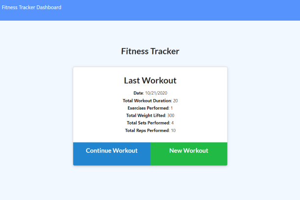
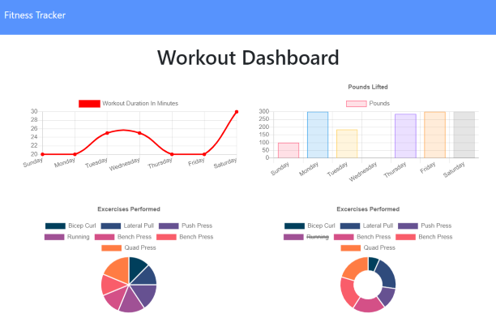

# # FITNESS TRACKER

---

## Table of Contents

- [Installation](#installation)
- [Usage](#Usage)
- [Building the Application](#building-the-application)
- [Acceptance Criteria](#acceptance-criteria)
- [Credits](#credits)
- [Resources](#resources)
- [Contact](#contact)
- [Links](#Links)
- [License](#license)

---

## Installation

1. Follow the GitHub Repository Link in the [links](#Links) section below.
1. Clone the repository using an SSH key.
1. Open GitBash and use "git clone" to clone the repository.
1. Run npm install to install associated modules.

---

## Usage

Edit using VSCode after [installation](#installation). Config, routes, models, public, and seeders folders are included along with server file and package.json files. This application is deployed to Heroku, see [links](#Links) section below.

---

## Building the Application

For this application we were given the front end code and tasked with developing the back end routes based on the front end requests. Overall there were not a lot of challenges with the back-end, however there were a few issues with the front-end code that I was not able to fix due to the assignment stating we could not touch the front end code. 

Some of these issues include:
- The charts and graphs do not account for multiple workouts in the same day, if this happens they just count them as two separate days.
- The days of the week do not actually match up to the correct days of the week when rendered.
- It was confirmed with TA's that the .limit(7) method was the correct way to complete the /api/workouts/range route, however this just gives 7 individual workouts, not 7 days of workouts, but given the first & second issues on this list it wouldn't matter because they wouldn't be accounted for correctly anyways.
- The for to create a new exercise does not disable the "Add Exercise" or "Complete" buttons after the first new exercise is added, so if you click either one again when the form is blank you get an empty exercise in your array. I added validation on the back-end but without being able to edit the front end code, there is no way to alert the user of the error.

---

## Acceptance Criteria

When the user loads the page, they should be given the option to create a new workout or continue with their last workout. :heavy_check_mark:

The user should be able to:

- Add exercises to a previous workout plan. :heavy_check_mark:

- Add new exercises to a new workout plan. :heavy_check_mark:

- View the combined weight of multiple exercises on the `stats` page. :heavy_check_mark:

Must be deployed to Heroku using MongoDB Atlas. :heavy_check_mark:

---

## Credits

As always, a huge thanks to our instructional staff for all their hard work!

## Resources

- [w3schools](https://www.w3schools.com)
- [Node.js](https://nodejs.org/en/)
- [Express](https://expressjs.com/)
- [MongoDB](https://www.mongodb.com/)
- [Mongoose.js](https://mongoosejs.com/)
- [MongoDB Atlas](https://www.mongodb.com/cloud/atlas)
- [Morgan.js](https://www.npmjs.com/package/morgan)
- [Heroku](https://heroku.com)

---

## Links

[Repository Link](https://github.com/aimeecesler/fitness-tracker)

[Deployed Application](https://ace-fitness.herokuapp.com/)

---

## License

Copyright &copy; 2020 Aimee Corbin Esler

    Permission is hereby granted, free of charge, to any person obtaining a copy
    of this software and associated documentation files (the "Software"), to deal
    in the Software without restriction, including without limitation the rights
    to use, copy, modify, merge, publish, distribute, sublicense, and/or sell
    copies of the Software, and to permit persons to whom the Software is
    furnished to do so, subject to the following conditions:

    The above copyright notice and this permission notice shall be included in all
    copies or substantial portions of the Software.

    THE SOFTWARE IS PROVIDED "AS IS", WITHOUT WARRANTY OF ANY KIND, EXPRESS OR
    IMPLIED, INCLUDING BUT NOT LIMITED TO THE WARRANTIES OF MERCHANTABILITY,
    FITNESS FOR A PARTICULAR PURPOSE AND NONINFRINGEMENT. IN NO EVENT SHALL THE
    AUTHORS OR COPYRIGHT HOLDERS BE LIABLE FOR ANY CLAIM, DAMAGES OR OTHER
    LIABILITY, WHETHER IN AN ACTION OF CONTRACT, TORT OR OTHERWISE, ARISING FROM,
    OUT OF OR IN CONNECTION WITH THE SOFTWARE OR THE USE OR OTHER DEALINGS IN THE
    SOFTWARE.
